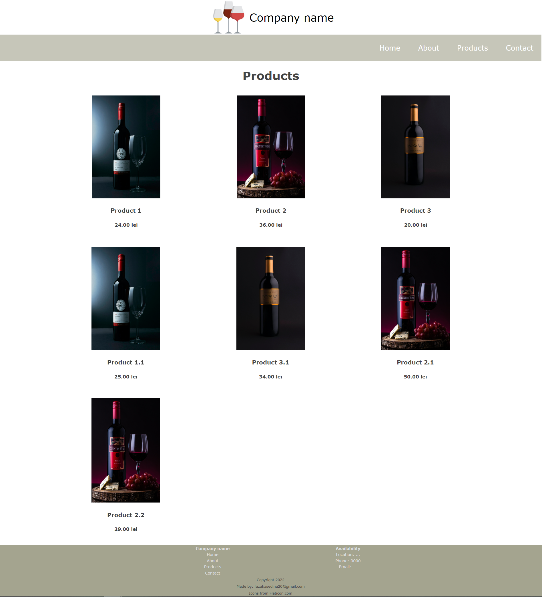
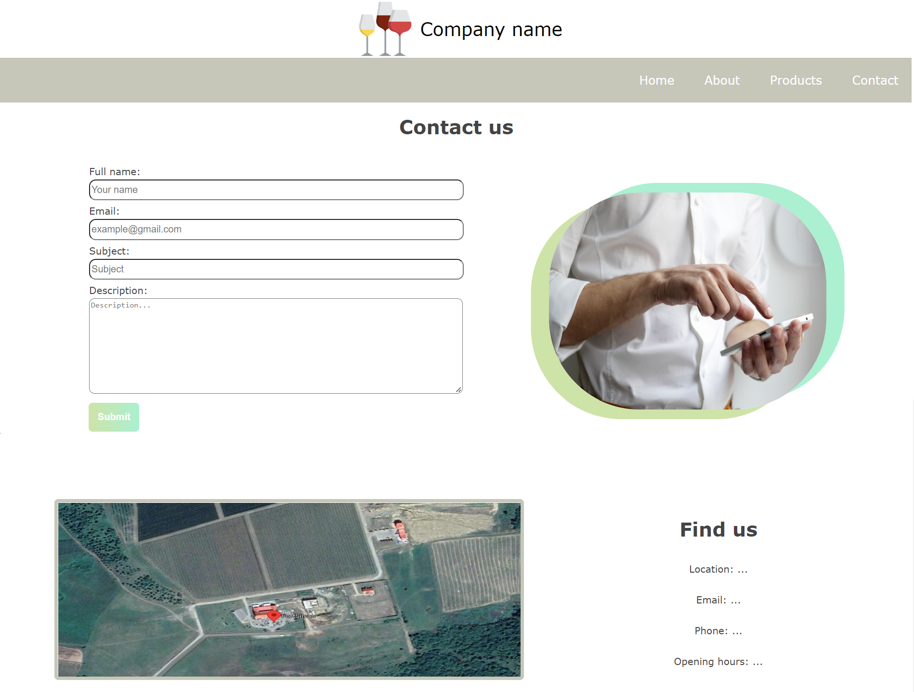

# Base-UI-With-React

I made a simple React project with hard-coded data. The main inspiration is a vineyard close to my town.




Getting started
---------------

- Clone the repository
```
git clone https://github.com/FazakasEdina/Base-UI-With-React.git
```
- Install dependencies
```
cd Base-UI-With-React
npm install
```
- Build and run the project
```
npm start
```
- Navigate to `http://localhost:3000`


Contact
-------
If you require any further information, feel free to contact me.

Email: fazakasedina20@gmail.com